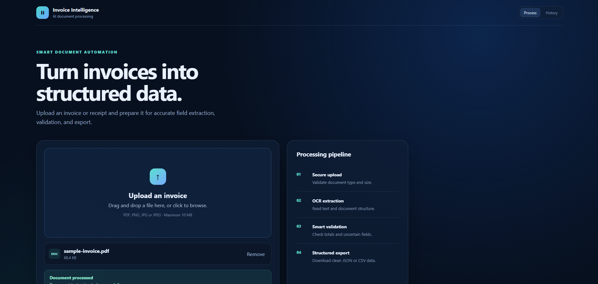
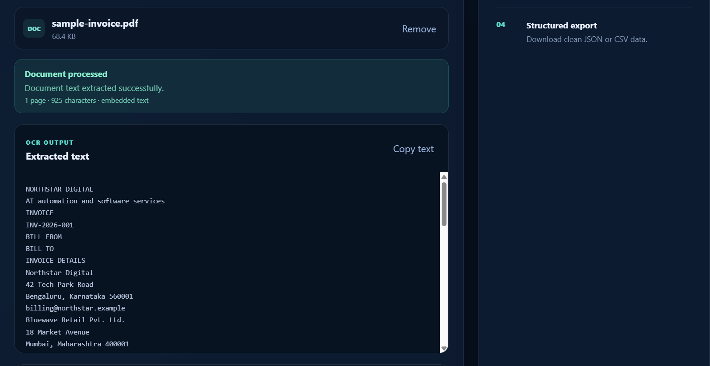
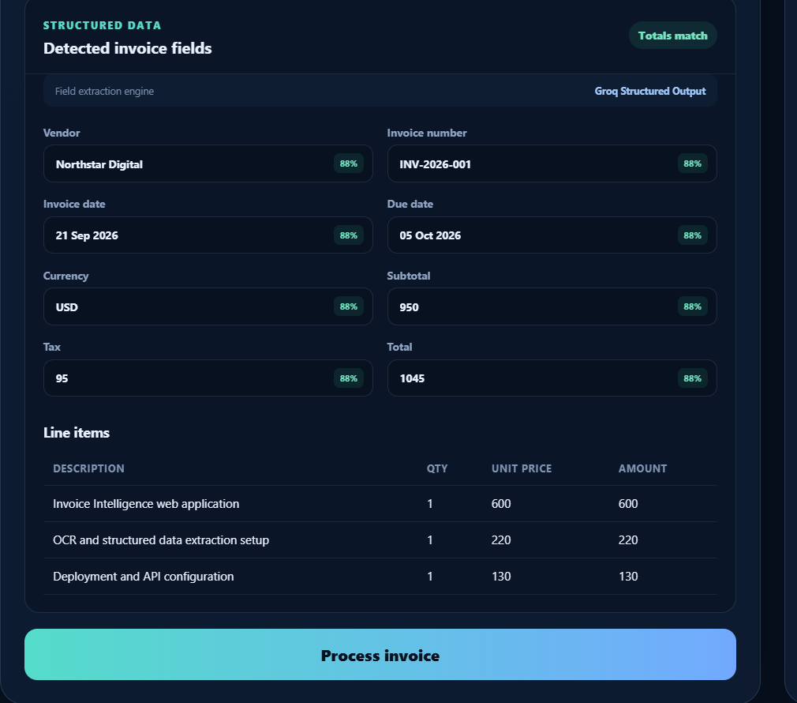
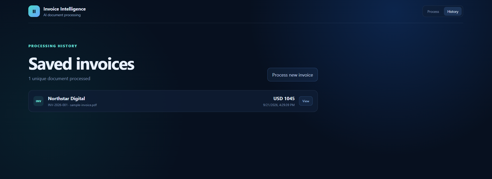
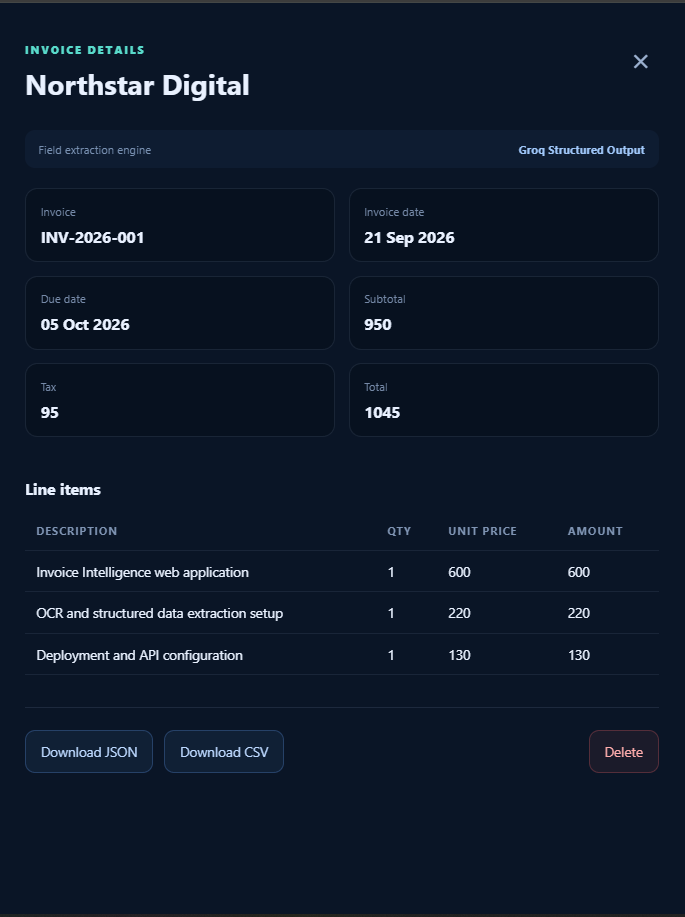

# Invoice Intelligence

A full-stack AI document-processing application that turns PDF or image invoices
into validated, searchable business data. It combines OCR, deterministic parsing,
and optional LLM structured extraction behind a polished React interface.

## Why this project matters

Invoice processing is a practical automation problem: teams need data extracted
accurately, totals checked, duplicate uploads detected, and results exported for
other systems. This project demonstrates an end-to-end implementation rather
than an isolated AI prompt or API demo.

## Features

- Drag-and-drop PDF, PNG, and JPEG uploads up to 10 MB
- Embedded PDF text extraction with Tesseract OCR fallback
- Vendor, invoice number, dates, currency, totals, and line-item extraction
- Optional Groq strict structured output using `openai/gpt-oss-20b`
- Deterministic fallback when the LLM is unavailable or times out
- Confidence scores, total validation, and extraction warnings
- Editable extracted fields and raw OCR inspection
- SHA-256 duplicate detection and persistent SQLite history
- Invoice detail view plus JSON and CSV exports
- Confirmed record deletion
- Dockerized React/Nginx frontend and FastAPI backend

## Application Screenshots

### Invoice Upload Interface



### OCR Text Extraction



### Structured Invoice Results



### Processing History



### Invoice Details and Export



## Architecture

```text
Browser
  └── React UI served by Nginx
        └── /api reverse proxy
              └── FastAPI
                    ├── PyMuPDF + Tesseract OCR
                    ├── Deterministic extractor
                    ├── Optional Groq extractor
                    └── SQLite persistence
```

## Quick start with Docker

Requirements: Docker Engine with Docker Compose.

```bash
git clone <your-repository-url>
cd invoice-intelligence-app

# Optional: enables Groq structured extraction.
cp backend/.env.example .env
# Add GROQ_API_KEY to .env if you have one.

docker compose up --build
```

Open `http://localhost:8080`. The API health endpoint is available at
`http://localhost:8080/health`.

The SQLite database is stored in the named `invoice-data` Docker volume, so
invoice history survives container recreation. Do not commit API keys.

## Deploy on Render

The repository includes a `render.yaml` Blueprint. The production Docker image
builds the React frontend and serves it from the same FastAPI service, so the
deployed demo uses one public URL and does not require cross-origin setup.

1. Push this project to a GitHub repository.
2. In Render, choose **New > Blueprint** and connect that repository.
3. Render detects `render.yaml`; approve the `invoice-intelligence` service.
4. Enter `GROQ_API_KEY` when prompted, or leave it blank to use the
   deterministic extractor.
5. Wait for the health check to pass, then open the generated `onrender.com`
   URL.

The free Blueprint is intended for a portfolio demonstration. Its filesystem
is ephemeral, so invoice history may reset after a restart or redeploy. For
persistent demo data, change to a paid service and attach a disk at `/app/data`,
or migrate persistence to PostgreSQL.

## Local development

### Backend

Python 3.11+ and Tesseract 5 are recommended.

```bash
cd backend
python -m venv .venv
source .venv/bin/activate  # Windows: .venv\Scripts\activate
pip install -r requirements.txt
cp .env.example .env
uvicorn app.main:app --reload
```

API documentation: `http://localhost:8000/docs`

### Frontend

```bash
cd frontend
npm ci
cp .env.example .env
npm run dev
```

Open `http://localhost:5173`.

## Configuration

| Variable | Default | Purpose |
|---|---|---|
| `DATABASE_PATH` | `data/invoices.db` | SQLite database location |
| `GROQ_API_KEY` | unset | Enables optional LLM extraction |
| `GROQ_MODEL` | `openai/gpt-oss-20b` | Groq model used for structured output |
| `GROQ_TIMEOUT_SECONDS` | `20` | LLM request timeout |
| `ALLOWED_ORIGINS` | `http://localhost:5173` | CORS origin list |
| `VITE_API_URL` | `http://localhost:8000` | Frontend API base URL |

## Tests and production build

```bash
cd backend
pytest

cd ../frontend
npm ci
npm run build
```

## API endpoints

| Method | Endpoint | Purpose |
|---|---|---|
| `GET` | `/health` | Service, OCR, database, and LLM status |
| `POST` | `/api/v1/invoices/upload` | Process an invoice or receipt |
| `GET` | `/api/v1/invoices` | List processed invoices |
| `GET` | `/api/v1/invoices/{id}` | Retrieve invoice details |
| `GET` | `/api/v1/invoices/{id}/export?format=json\|csv` | Export structured data |
| `DELETE` | `/api/v1/invoices/{id}` | Delete a stored invoice |

## Production notes

- Use a persistent disk or managed database for production data.
- Terminate TLS at the hosting platform or reverse proxy.
- Store `GROQ_API_KEY` in the platform's secret manager.
- Restrict `ALLOWED_ORIGINS` to the deployed frontend domain when services are
  hosted separately.
- SQLite is suitable for a portfolio demo and small single-instance workloads;
  use PostgreSQL when running multiple backend instances.
